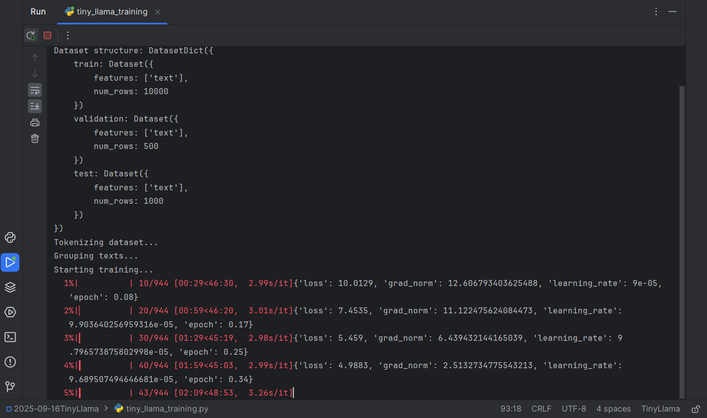

# Applied NLP Assignment 1(Evaluate a Tiny Llama-2 Model)

## 📁Project Structure
```bash
TinyLlama/
├── tiny_llama_training.py
├── tiny_llama_eval.py
└── tiny_llama_test.py
├── data/                    # Datasets (English and Chinese)
│   ├── zh_train.jsonl
│   ├── zh_dev.jsonl
│   └── ...               
├── llama-42m/          # Base model weight
├── llama-42m-zh-fairytales-cosine/  # Fine-tuned with cosine scheduler
└── llama-42m-zh-fairytales-linear/  # Fine-tuned with linear scheduler
```


## 🛠️Preparation
### environment

```bash
git clone https://github.com/kangningyuan/TinyLlama.git
cd TinyLlama
pip install -r requirements.txt
```
### download model weight
BaiduCloud
```bash
 https://pan.baidu.com/s/11NtL1UCGsaGnBae41e-DqA?pwd=9bsu
```
(or)Onedrive：
```bash
https://1drv.ms/f/c/ef07f10048c44e43/ElQWYck70KNEpHUuDDFVuxIB4Dq8JJcMtbTBGRylLWzU3g?e=x3f75V

```

## 🚀 Usage

### Training the Model

To fine-tune the model on Chinese data:

```bash
python ./tiny_llama_training.py
```

This script will:
1. Load the base TinyLlama-2 model
2. Preprocess the Chinese dataset
3. Fine-tune the model using cosine learning rate scheduler
4. Save the fine-tuned model to `llama-42m-zh-fairytales-cosine/`

### Evaluating Model Perplexity

To compute perplexity on the test set:

```bash
python ./tiny_llama_eval.py
```

Make sure to update the `MODEL_PATH` variable in the script to point to your trained model.

### Testing Text Generation

To generate text with the fine-tuned model:

```bash
python ./tiny_llama_test.py
```

The script includes multiple Chinese prompts and allows you to adjust temperature and other generation parameters.


## ⚙️ Configuration



Key parameters in the training script:(You can change it
 to train different model)

```python
# Learning parameters
lr = 1e-4
epochs = 8
train_bsz = 32
eval_bsz = 16

# Model configuration
block_size = 512  # Context length
lr_scheduler_type = "cosine"  # Or "linear" for comparison
```


## 👨‍💻 Author

**Kangning Yuan**  
yuankangning@outlook.com  
GitHub: [kangningyuan](https://github.com/kangningyuan)
